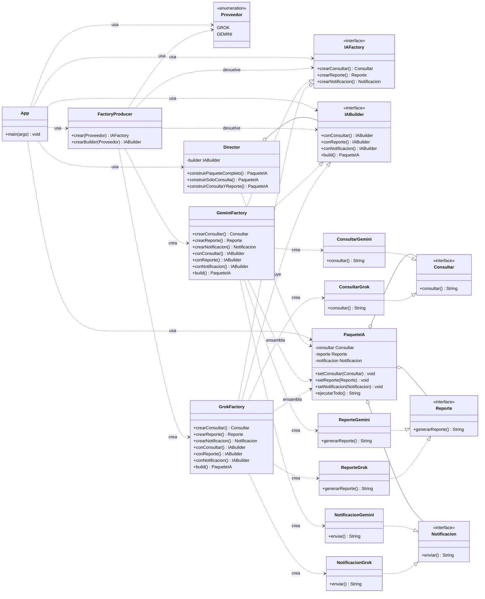

# Diagrama de clases — Abstract Factory + Builder + Director

Patrones aplicados:

- **Abstract Factory**: `IAFactory` crea la **familia completa** de productos
  coherentes. `FactoryProducer` fabrica fábricas.
- **Builder**: `IABuilder` ensambla paso a paso un objeto complejo `PaqueteIA`.
- **Director**: conoce las **recetas** de construcción y las ejecuta sobre cualquier `IABuilder`.

Las fábricas concretas (`GrokFactory`, `GeminiFactory`) cumplen **dos roles**: son
`IAFactory` (crean productos individuales) y `IABuilder` (ensamblan el `PaqueteIA`
reutilizando sus propios métodos `crear...()`, sin mezclar familias).

> Nota: `App` sólo conoce las abstracciones (`IAFactory`, `IABuilder`), el
> `FactoryProducer` y el `Director`. La familia la selecciona una clase concreta
> por herencia; la receta la define el `Director`; el paso a paso lo hace la
> fábrica concreta en su rol de `Builder`, reutilizando `crear...()` para no
> mezclar productos de distintas familias.
