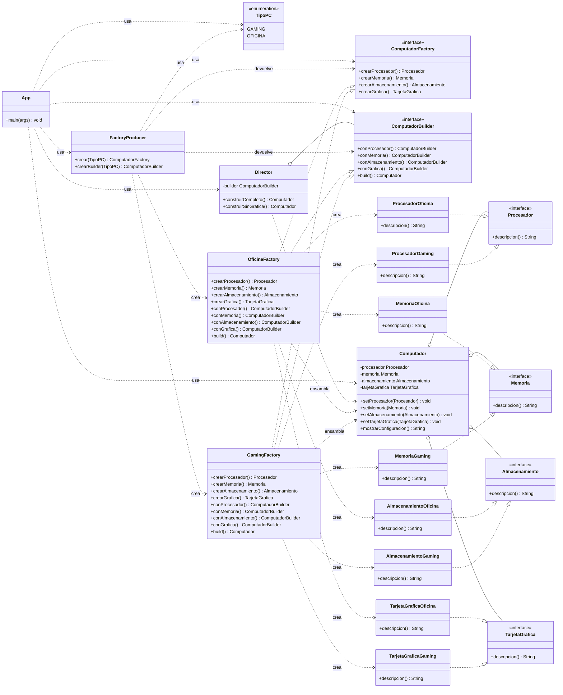

# Diagrama de clases — Abstract Factory + Builder + Director

Patrones aplicados:

- **Abstract Factory**: `ComputadorFactory` crea la **familia completa** de
  componentes coherentes. `FactoryProducer` fabrica fábricas.
- **Builder**: `ComputadorBuilder` ensambla paso a paso el objeto complejo `Computador`.
- **Director**: conoce las **recetas** de construcción y las ejecuta sobre cualquier
  `ComputadorBuilder`.

Las fábricas concretas (`GamingFactory`, `OficinaFactory`) cumplen **dos roles**: son
`ComputadorFactory` (crean componentes individuales) y `ComputadorBuilder` (ensamblan
el `Computador` reutilizando sus propios `crear...()`, sin mezclar familias).

> Nota: `App` sólo conoce las abstracciones (`ComputadorFactory`, `ComputadorBuilder`),
> el `FactoryProducer` y el `Director`. La familia la elige la fábrica concreta; la
> receta la define el `Director`; el paso a paso lo hace la fábrica concreta en su rol
> de `Builder`, reutilizando `crear...()` para no mezclar componentes de otra familia.
