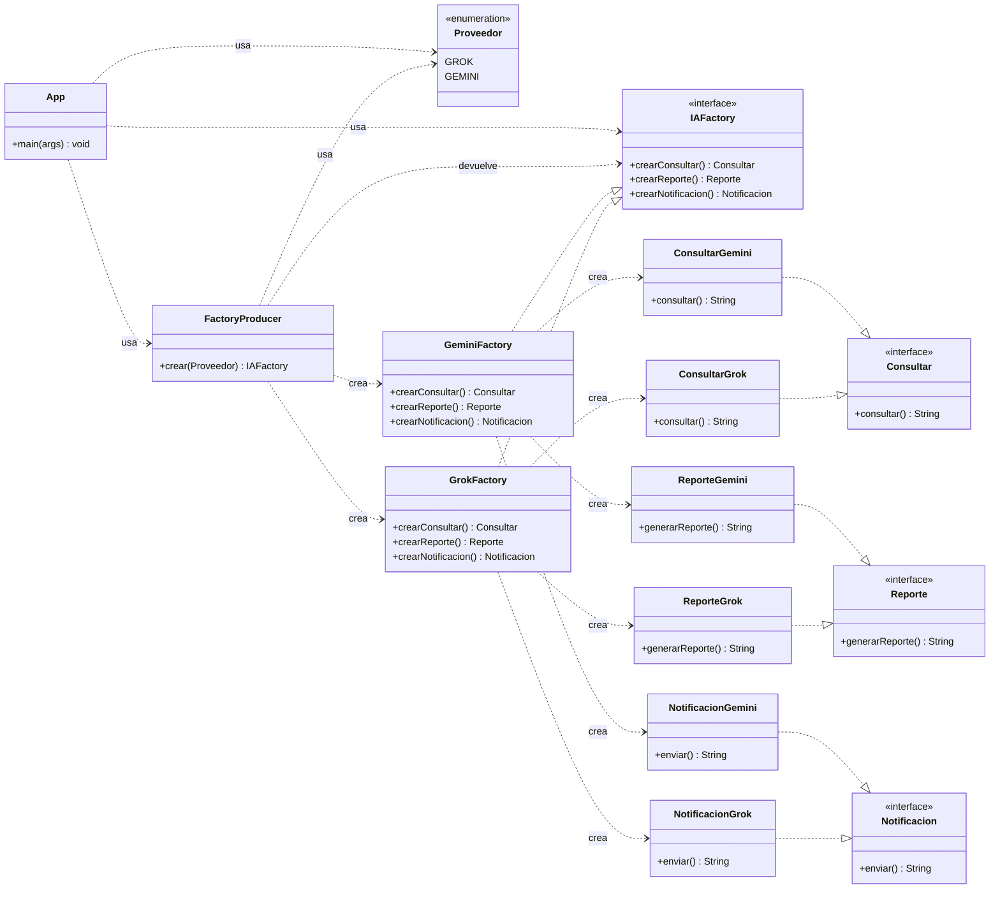

# Diagrama de clases — Abstract Factory (fábrica de fábricas)

Patrón aplicado: **Abstract Factory**. Una sola fábrica (`IAFactory`) crea la
**familia completa** de productos coherentes. `FactoryProducer` fabrica fábricas.

> Nota: `App` sólo conoce `IAFactory` (abstracción) y `FactoryProducer`.
> La familia la selecciona una clase concreta por herencia, no un `switch` en la fábrica.
