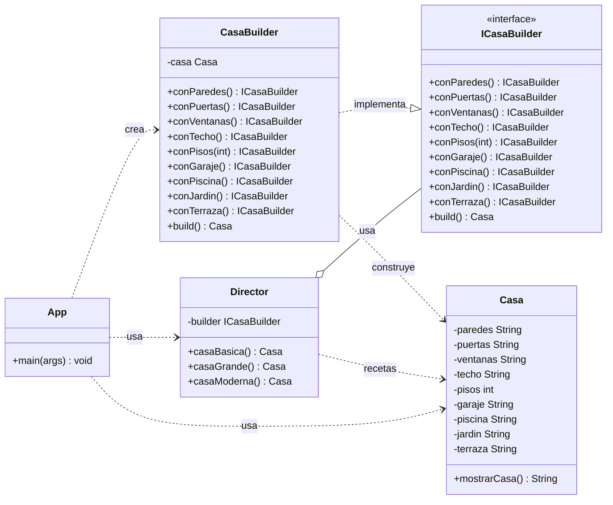

# Diagrama de clases — Builder + Director

Patrón **Builder** (GoF). El **Director** conoce las recetas (los pasos y su orden),
el **ConcreteBuilder** sabe construir cada parte y el **Product** es el resultado.

## Recetas del Director

| Receta | Partes incluidas |
|---|---|
| `casaBasica()` | paredes, puertas, ventanas, techo, pisos(1) |
| `casaGrande()` | paredes, puertas, ventanas, techo, pisos(2), garaje, piscina, jardin |
| `casaModerna()` | paredes, puertas, ventanas, techo, pisos(1), piscina, terraza |

> Nota: el mismo `CasaBuilder` construye todas las variantes; la diferencia está en la
> **receta** que ejecuta el `Director`. `App` solo decide qué receta pedir.
