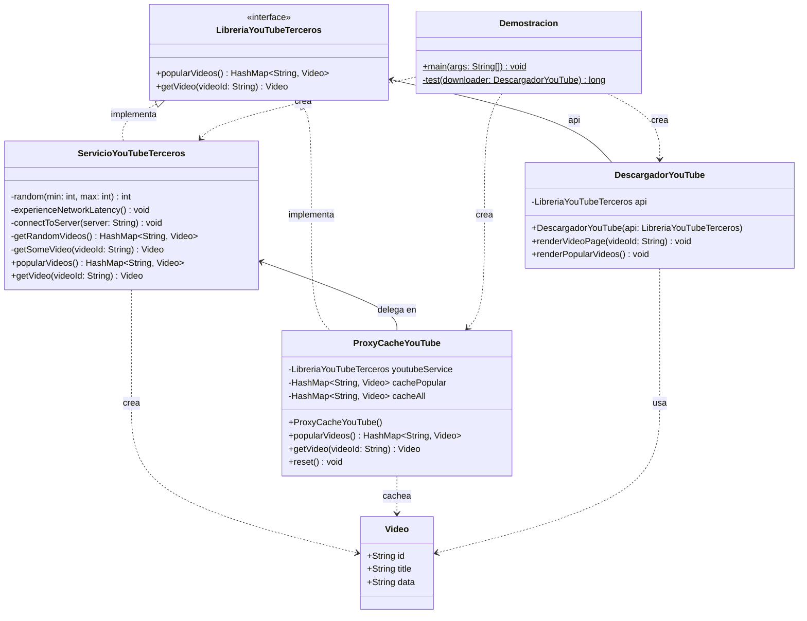

```mermaid
classDiagram
    class LibreriaYouTubeTerceros {
        <<interface>>
        +popularVideos() HashMap~String, Video~
        +getVideo(videoId: String) Video
    }

    class ServicioYouTubeTerceros {
        -random(min: int, max: int) int
        -experienceNetworkLatency() void
        -connectToServer(server: String) void
        -getRandomVideos() HashMap~String, Video~
        -getSomeVideo(videoId: String) Video
        +popularVideos() HashMap~String, Video~
        +getVideo(videoId: String) Video
    }

    class Video {
        +String id
        +String title
        +String data
    }

    class ProxyCacheYouTube {
        -LibreriaYouTubeTerceros youtubeService
        -HashMap~String, Video~ cachePopular
        -HashMap~String, Video~ cacheAll
        +ProxyCacheYouTube()
        +popularVideos() HashMap~String, Video~
        +getVideo(videoId: String) Video
        +reset() void
    }

    class DescargadorYouTube {
        -LibreriaYouTubeTerceros api
        +DescargadorYouTube(api: LibreriaYouTubeTerceros)
        +renderVideoPage(videoId: String) void
        +renderPopularVideos() void
    }

    class Demostracion {
        +main(args: String[]) void$
        -test(downloader: DescargadorYouTube) long$
    }

    LibreriaYouTubeTerceros <|.. ServicioYouTubeTerceros : implementa
    LibreriaYouTubeTerceros <|.. ProxyCacheYouTube : implementa
    LibreriaYouTubeTerceros <-- DescargadorYouTube : api
    ServicioYouTubeTerceros <-- ProxyCacheYouTube : delega en
    ServicioYouTubeTerceros ..> Video : crea
    ProxyCacheYouTube ..> Video : cachea
    DescargadorYouTube ..> Video : usa
    Demostracion ..> DescargadorYouTube : crea
    Demostracion ..> ProxyCacheYouTube : crea
    Demostracion ..> ServicioYouTubeTerceros : crea
```
