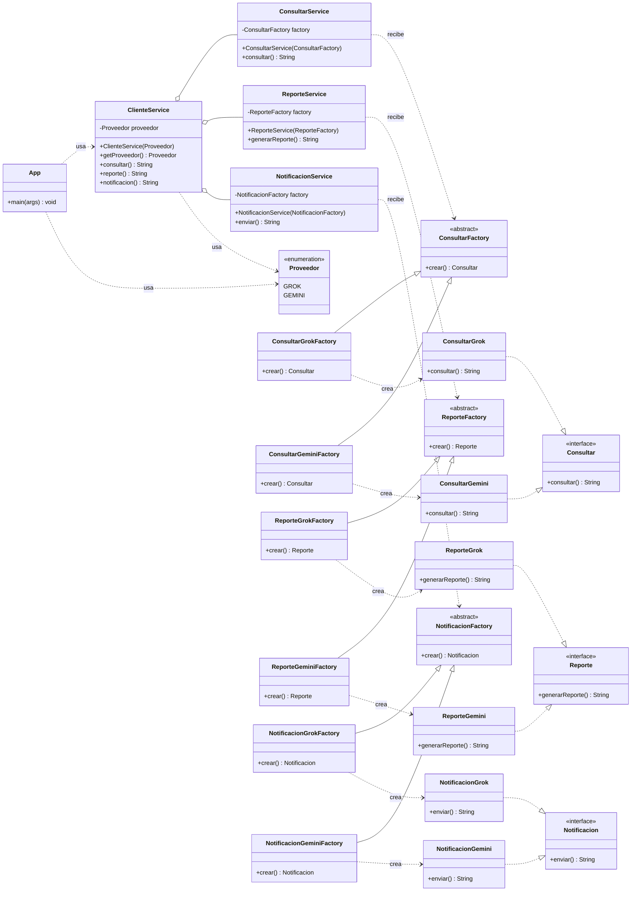

# Diagrama de clases — Factory Method

Patrón aplicado: **Factory Method**. Cada producto tiene su jerarquía de creadores;
la subclase concreta decide qué producto se instancia (sin `switch` en la fábrica).

> Nota: `ClienteService` es el *composition root*; mapea `Proveedor` a los
> creadores concretos (`ConsultarGrokFactory`, etc.) y se los inyecta a los services.
